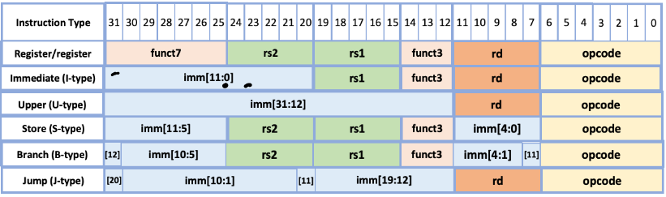

# Formato de instrucciones

## R-Type

Instrucciones usan solo registros

    0-6     OP Code
    7-11    Registro destino
    12-14   func3
    15-19   Registro 1
    20-24   Registro 2
    25-31   func7

## I-Type

Instrucciones que reciben un immediato

    0-6     OP Code
    7-11    Registro destino
    12-14   func3
    15-19   Registro 1
    20-31   Immediato

## U-Type

Cuando se usan immediatos muy grandes

    0-6     OP Code
    7-11    Registro destino
    12-31   Inmediato

## S-Type

Se usa para stores

    0-6     OP Code
    7-11    Inmediato (bits 4-0)
    12-14   func3
    15-19   Registro 1
    20-24   Registro 2
    25-31   Inmediato (11-5)

## B-Type

Para las operaciones beq y bne

    0-6     OP Code
    7-7     bit 11 del offset
    8-11    bits 4:1 del offset
    12-14   func3
    15-19   Registro 1
    20-24   Registro 2
    25-30   bits 10:5 del offset
    31-31   bit 12 del offset

## J-Type (jal)

    0-6     OP Code
    7-11    Registro destino
    12-19   bits 19:12 del offset
    20-20   bit 11 del offset
    21-30   bits 10:1 del offset
    31-31   bit 20 del offset

## J-Type (jalr)

    0-6     OP Code
    7-11    Registro destino
    12-14   func3
    15-19   Registro 1
    20-31   12 bits del offset

# Documentacion externa de componentes VHDL

## Componente ALU

Recibe un opcode traducido, dependiendo de lo que sea este aplica diferentes operaciones (esto es decidido mediante un switch-case). Para realizar las operaciones recibe 2 operadores (los cuales vienen de registros o de data forwarding) y un immediato, elije la usada dependiendo de la operacion utilizada.

En caso de recibir un opcode invalido, simplemente retorna un 0.

## Componente translator

Recibe el opcode, funct3 y funct7 de la instruccion, los traduce a el opcode que es utilizado en la simulación, esto se logra mediante un Case que revisa el opcode y una serie de ifs comparando funct3 (funct3 y funct7 en el caso de los registros)

En caso de un error, el codigo generado es un 11111, lo que causa una excepción que detiene el procesador.

## Componente branch_jump

Este componente se usa para las operaciones beq, bne, jal y jalr. Recibe como parámetros el opcode, los dos operandos para los branches, el pc actual, los tres tipos de offset y el valor del registro para el jalr.

Lo primero que hace es identificar el tipo de operacion a realizar segun el opcode. 

Si la operacion es beq o bne entonces va a tomar los dos operandos, los va a comparar segun la operacion que es y si la operacion se cumple se activa una bandera para saber si hay que tomar ese branch o no.

Si esa bandera esta activada, se calcula el nuevo pc sumandole al pc actual el offset de branches y se retorna. Tambien se activa otra bandera para saber desde el circuito si hay que modificar el pc y se retorna esa bandera.

Si la operacion es jal se activa una bandera para saber desde el circuito si se puede escribir en el registro destino el retorno del jump y se retorna la bandera.

Luego se calcula el retorno del jump sumandole 1 al pc actual y se retorna ese valor. Se calcula tambien el nuevo pc sumandole al pc actual el offset de jal y se retorna ese valor. 

Finalmente, se activa otra bandera para saber desde el circuito si hay que modificar el pc y se retorna esa bandera.

Si la operacion es jalr se activa una bandera para saber desde el circuito si se puede escribir en el registro destino el retorno del jump y se retorna la bandera.

Luego se calcula el retorno del jump sumandole 1 al pc actual y se retorna ese valor. Se calcula el offset completo sumandole al offset de jalr el valor del registro para el jalr.

Se calcula el nuevo pc sumandole al pc actual el offset completo recien calculado y se retorna ese valor. Finalmente, se activa otra bandera para saber desde el circuito si hay que modificar el pc y se retorna esa bandera.

## Componente cache_instrucciones

Este componente simula una cache de instrucciones de mapeo directo con bloques de 8 palabras y 16 bloques, no contempla escrituras pues es un cache de instrucciones, es solo de lectura y en caso de miss de lectura hace allocate de los bloques faltantes. Las direcciones del circuito son de 14 bits, por conceso de grupo y limitaciones de logisim, por esto se dividen para la cache de la siguiente manera: tag de 7 bits, un índice de 4 bits y un offset de 3 bits.

Funciona como una máquina de estados con los siguientes estados posibles:

  - idle: espera a que la cpu habilite una operacion

  - check_hit: revisa si hay hit

  - read_miss: lee un bloque desde la ram

  - allocate: carga un bloque a cache

El proceso sería el siguiente: primero, verifica si hay una señal de reset, si sí pasa al estado idle, si no, va a ir pasando entre cada estado cada vez que llegue una señal de reloj. 

El primer estado es el de revisar si hay hit, para esto se accede a la posicion en el arreglo que simula las lineas de cache segun los bits del indice y se toma como el bloque actual, se compara el tag de este con el tag de la direccion ingresada, si son iguales y el bit valid de el bloque actual esta en 1 (este bit queda por la idea de coherencia de cache que no se implementa pero puede implementarse a futuro) entonces se detecta el hit y se activa la bandera hit_detected.

Si es un hit, devuelve el dato solicitado si esta activada la bandera de lectura cpu_read. Si no se da esto se activa el miss_detected y se da un miss.

En caso de Miss, pasa a READ_MISS donde se leen los datos desde memoria. Una vez leidos todos los bloques se pasa a ALLOCATE, que basicamente guarda la informacion en los arreglos internos.

Esta caché escribe los datos en ella con 3 ciclos de retraso a su petición a la RAM, en otras palabras existe una latencia de 3 ciclos entre RAM y cache.

## Componente cache_datos

Este componente simula una cache de datos de mapeo directo con bloques de 4 palabras y 32 bloques, con las politicas Write Through y Write Allocate (con la intención de que fuera más fácil visualizar lo que ocurre en el flujo del circuito). Las direcciones del circuito son de 14 bits, por conceso de grupo y limitaciones de logisim, por esto se dividen para la cache de la siguiente manera: tag de 7 bits, un índice de 5 bits y un offset de 2 bits.

Funciona como una máquina de estados con los siguientes estados posibles:
    
    
   - idle: espera a que la cpu habilite una operacion

   - check_hit: revisa si hay hit

   - read_miss: lee un bloque desde la ram
   
   - write_back: escribe un bloque sucio en la ram antes de escribir

   - allocate: carga un bloque a cache

   - write_through: escribe en cache y en la ram

El proceso sería el siguiente: primero, verifica si hay una señal de reset, si sí pasa al estado idle, si no, va a ir pasando entre cada estado cada vez que llegue una señal de reloj. 

El primer estado es el de revisar si hay hit, para esto se accede a la posicion en el arreglo que simula las lineas de cache segun los bits del indice y se toma como el bloque actual, se compara el tag de este con el tag de la direccion ingresada, si son iguales y el bit valid de el bloque actual esta en 1 (este bit queda por la idea de coherencia de cache que no se implementa pero puede implementarse a futuro) entonces se detecta el hit y se activa la bandera hit_detected.

Si es un hit, se revisa si hay señal para escribir cpu_write, en caso de que la haya pasa a el estado WRITE_THROUGH, sino pasa a idle y devuelve el dato solicitado si esta activada la bandera de lectura cpu_read. Si no se da esto se activa el miss_detected y se da un miss.

En caso de Miss, pasa a Write_Back si el bloque dice ser valido y sucio o a READ_MISS en el caso contrario. Write_Back se encarga de escribir en memoria, mientras tenga palabras que escribir no sale de este estado, una vez termina sale a READ_MISS. En READ_MISS se leen los datos desde memoria. Una vez leidos todos los bloques se pasa a ALLOCATE, que basicamente guarda la informacion en los arreglos internos. Write_Through pasa los datos para que sean escritos en la RAM.

Esta caché escribe los datos en ella con 3 ciclos de retraso a su petición a la RAM, en otras palabras existe una latencia de 3 ciclos entre RAM y cache.

## Componente address_balancer

Este componente se asegura de que los 2 cores accedan a puntos diferentes de la memoria ram, esto lo logra recibiendo como input el address de memoria que sale de cada core, al entrar simplemente se altera su bit 12, el core 1 tiene un 0 y el core 2 un 1, de esta manera se subdividen las direcciones en 2, evitando completamente que un core acceda a la memoria de otro, tanto instrucciones como datos.

Este cambio es el equivalente del circuito del cambio entre direcciones virtuales y fisicas, en este caso el unico cambio importante ocurre para el core 2, por ejemplo: Si el core 2 pide leer la posicion de memoria 0, en realidad se leera la posicion 1000h, esto debido a la conversión generada por address_balancer