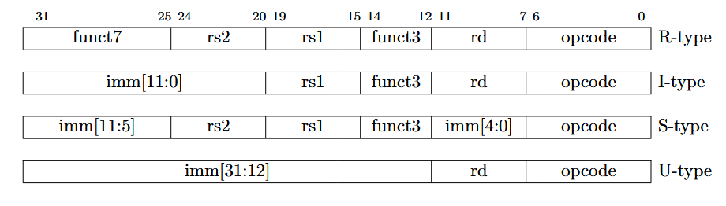

# Formato de instrucciones

## Aclaraciones

Nuestro instruccion set solo necesita 5 bits, pero igual se seguirá el sistema normal de RISC-V por simplicidad, solamente alterando la cantidad de bits usados para opCode

## R-Type

Instrucciones usan solo registros

    0-6     OP Code
    7-11    Registro destino
    12-14   func3
    15-19   Registro 1
    20-24   Registro 2
    25-31   func7

## I-Type

Instrucciones que reciben un immediato

    0-6     OP Code
    7-11    Registro destino
    12-14   func3
    15-19   Registro 1
    20-31   Immediato

## U-Type

Cuando se usan immediatos muy grandes

    0-6     OP Code
    7-11    Registro destino
    12-31   Inmediato

## S-Type

Se usa para stores

    0-6     OP Code
    7-11    Inmediato (bits 4-0)
    12-14   func3
    15-19   Registro 1
    20-24   Registro 2
    25-31   Inmediato (11-5)

## B-Type

Para las operaciones beq y bne

    0-6     OP Code
    7-7     bit 11 del offset
    8-11    bits 4:1 del offset
    12-14   func3
    15-19   Registro 1
    20-24   Registro 2
    25-30   bits 10:5 del offset
    31-31   bit 12 del offset

## J-Type (jal)

    0-6     OP Code
    7-11    Registro destino
    12-19   bits 19:12 del offset
    20-20   bit 11 del offset
    21-30   bits 10:1 del offset
    31-31   bit 20 del offset

## J-Type (jalr)

    0-6     OP Code
    7-11    Registro destino
    12-14   func3
    15-19   Registro 1
    20-31   12 bits del offset

# Instrucciones

Instruccion| Tipo |
|-|-|
ADD | R
SUB | R
ADDi | I 
AND | R
OR | R
XOR | R
ANDi | I
ORi | I
XORi | I

# Documentacion externa de componentes VHDL

## Componente ALU

Recibe un opcode traducido, dependiendo de lo que sea este aplica diferentes operaciones (esto es decidido mediante un switch-case). Para realizar las operaciones recibe 2 operadores (los cuales vienen de registros o de data forwarding) y un immediato, elije la usada dependiendo de la operacion utilizada.

En caso de recibir un opcode invalido, simplemente retorna un 0.

## Componente translator

Recibe el opcode, funct3 y funct7 de la instruccion, los traduce a el opcode que es utilizado en la simulación, esto se logra mediante un Case que revisa el opcode y una serie de ifs comparando funct3 (funct3 y funct7 en el caso de los registros)

En caso de un error, el codigo generado es un 11111, lo que causa una excepción que detiene el procesador.

## Componente branch_jump

Este componente se usa para las operaciones beq, bne, jal y jalr. Recibe como parámetros el opcode, los dos operandos para los branches, el pc actual, los tres tipos de offset y el valor del registro para el jalr.

Lo primero que hace es identificar el tipo de operacion a realizar segun el opcode. 

Si la operacion es beq o bne entonces va a tomar los dos operandos, los va a comparar segun la operacion que es y si la operacion se cumple se activa una bandera para saber si hay que tomar ese branch o no.

Si esa bandera esta activada, se calcula el nuevo pc sumandole al pc actual el offset de branches y se retorna. Tambien se activa otra bandera para saber desde el circuito si hay que modificar el pc y se retorna esa bandera.

Si la operacion es jal se activa una bandera para saber desde el circuito si se puede escribir en el registro destino el retorno del jump y se retorna la bandera.

Luego se calcula el retorno del jump sumandole 1 al pc actual y se retorna ese valor. Se calcula tambien el nuevo pc sumandole al pc actual el offset de jal y se retorna ese valor. 

Finalmente, se activa otra bandera para saber desde el circuito si hay que modificar el pc y se retorna esa bandera.

Si la operacion es jalr se activa una bandera para saber desde el circuito si se puede escribir en el registro destino el retorno del jump y se retorna la bandera.

Luego se calcula el retorno del jump sumandole 1 al pc actual y se retorna ese valor. Se calcula el offset completo sumandole al offset de jalr el valor del registro para el jalr.

Se calcula el nuevo pc sumandole al pc actual el offset completo recien calculado y se retorna ese valor. Finalmente, se activa otra bandera para saber desde el circuito si hay que modificar el pc y se retorna esa bandera.
